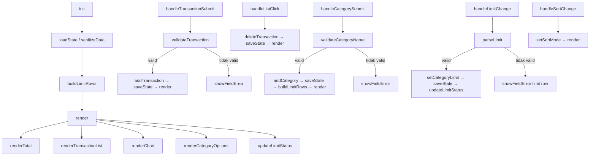
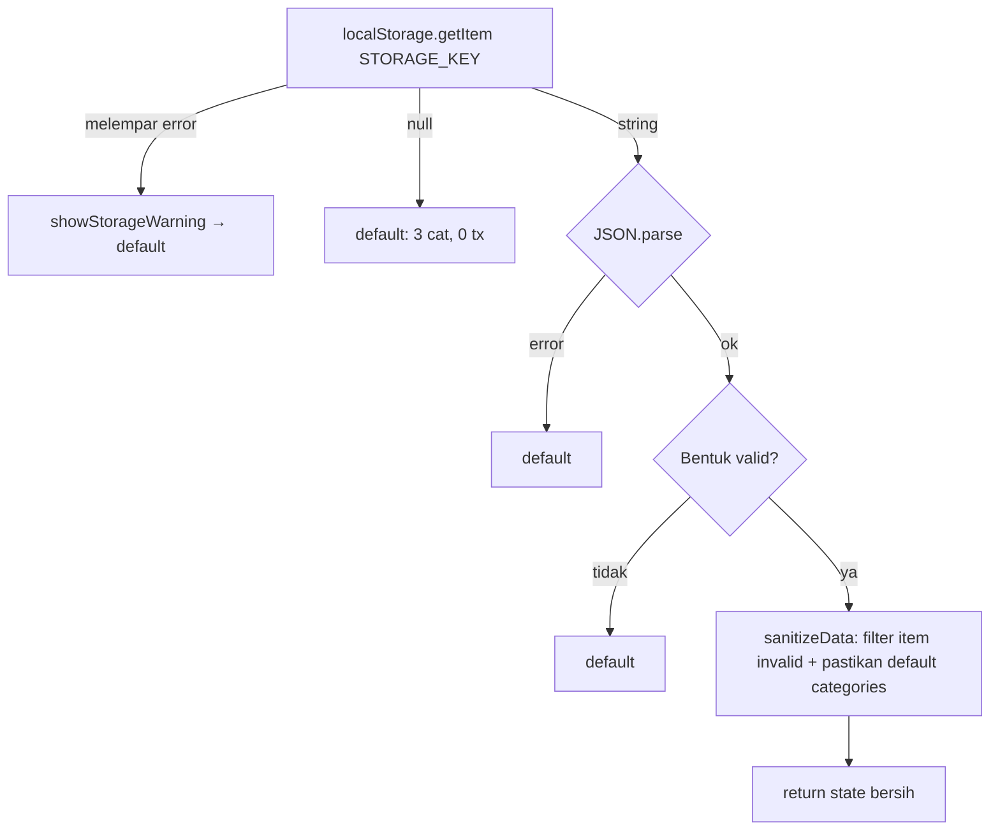

# Design Document

## Overview

Expense & Budget Visualizer adalah aplikasi web *mobile-first* berbasis HTML + CSS + JavaScript murni yang memungkinkan pengguna mencatat pengeluaran harian, melihat total balance, grafik distribusi per kategori, serta menetapkan batas (limit) pengeluaran per kategori — semuanya tanpa backend, tanpa login, dan tanpa framework.

Seluruh data disimpan di **Local Storage** browser. Tidak ada request ke server. Aplikasi dipublikasikan via GitHub Pages dan terdiri dari tepat tiga file:

| File | Peran |
|---|---|
| `index.html` | Struktur dan markup semantik |
| `css/style.css` | Styling, design tokens, layout responsif |
| `js/app.js` | Seluruh logika aplikasi |

**Fitur yang dikerjakan:** Input transaksi, Daftar transaksi, Total balance, Visual chart (Chart.js), Persistensi, Kategori kustom, Highlight over limit, Sort daftar transaksi.

---

## Architecture

### Pola State → Render

Semua perubahan data dikelola melalui **state di memori**. UI tidak pernah membaca data dari DOM — UI selalu digambar ulang dari state.

```
Aksi Pengguna
      │
      ▼
Event Handler
      │  memanggil fungsi mutasi
      ▼
State (di memori)  ◄──── loadState() (sekali saat init)
      │  disimpan ke
      ▼
Local Storage  ──────── saveState()
      │
      ▼
render()  →  renderTotal / renderTransactionList / renderChart / updateLimitStatus
```

Tidak ada two-way data binding, tidak ada reactive framework. Alur searah ini membuat perilaku aplikasi mudah diprediksi dan di-debug.

### Diagram Alur Tingkat Tinggi



### Pengelompokan Kode JavaScript

File `js/app.js` dibagi dengan komentar seksi berurutan:

```
// ─── 1 KONSTANTA ─────────────────────────────────────────────────────────────
// ─── 2 STATE ─────────────────────────────────────────────────────────────────
// ─── 3 STORAGE ───────────────────────────────────────────────────────────────
// ─── 4 VALIDASI ──────────────────────────────────────────────────────────────
// ─── 5 DATA TURUNAN ──────────────────────────────────────────────────────────
// ─── 6 RENDER ────────────────────────────────────────────────────────────────
// ─── 7 EVENT HANDLER ─────────────────────────────────────────────────────────
// ─── 8 INIT ──────────────────────────────────────────────────────────────────
```

---

## Components and Interfaces

### Struktur HTML

```html
<header>
  <h1>Expense & Budget Visualizer</h1>
</header>

<section id="total">
  <p id="total-value" aria-live="polite">Rp 0</p>
</section>

<form id="transaction-form" novalidate>
  <!-- label + input Item Name + elemen pesan error -->
  <!-- label + input Amount (type="text" inputmode="numeric") + elemen pesan error -->
  <!-- label + select Category + elemen pesan error -->
  <button type="submit">Add</button>
</form>

<section id="transactions">
  <select id="sort-select">…</select>
  <ul id="transaction-list"></ul>
  <p id="list-empty">Belum ada transaksi yang dicatat.</p>
</section>

<section id="chart">
  <div class="chart-wrap">
    <canvas id="category-chart"></canvas>
    <p id="chart-empty">Belum ada data untuk ditampilkan.</p>
  </div>
</section>

<section id="categories">
  <form id="category-form" novalidate>
    <!-- label + input nama kategori + elemen pesan error + tombol Add Category -->
  </form>
  <ul id="limit-list"></ul>
</section>

<div id="storage-warning" role="status" hidden>
  Peringatan: data tidak dapat disimpan/dimuat.
</div>
```

### Komponen Fungsional

| Komponen | Elemen DOM | Fungsi Render |
|---|---|---|
| Total Balance | `#total-value` | `renderTotal()` |
| Form Transaksi | `#transaction-form` | `handleTransactionSubmit()`, `clearErrors()` |
| Daftar Transaksi | `#transaction-list`, `#list-empty` | `renderTransactionList()` |
| Sort | `#sort-select` | `handleSortChange()`, `getSortedTransactions()` |
| Chart | `#category-chart`, `#chart-empty` | `renderChart()` |
| Kategori Kustom | `#category-form` | `handleCategorySubmit()` |
| Limit | `#limit-list` | `buildLimitRows()`, `updateLimitStatus()` |
| Peringatan Storage | `#storage-warning` | `showStorageWarning()` |

### Antarmuka Fungsi Utama

```javascript
// Util
formatRupiah(n: number): string
generateId(): string

// Storage
loadState(): { transactions: Transaction[], categories: Category[] }
sanitizeData(raw: unknown): { transactions: Transaction[], categories: Category[] }
saveState(): boolean

// Validasi
parseAmount(text: string): { ok: boolean, value?: number, error?: string }
validateTransaction(input, categories): { ok: boolean, values?, errors? }
validateCategoryName(text, categories): { ok: boolean, name?: string, error?: string }
parseLimit(text: string): { ok: boolean, value: number|null, error?: string }

// Mutasi State
addTransaction(values): Transaction
deleteTransaction(id: string): void
addCategory(name: string): Category
pickCategoryColor(categories: Category[]): string
setCategoryLimit(name: string, limit: number|null): void
setSortMode(mode: string): void

// Data Turunan (murni, tanpa efek samping)
calcTotal(transactions: Transaction[]): number
calcTotalsByCategory(transactions, categories): Record<string, number>
isOverLimit(category: Category, totals: Record<string, number>): boolean
getSortedTransactions(transactions: Transaction[], mode: string): Transaction[]

// Render DOM
render(): void
renderTotal(total: number): void
renderTransactionList(list, totals, categories): void
renderChart(categories, totals): void
renderCategoryOptions(): void
buildLimitRows(): void
updateLimitStatus(totals): void
showFieldError(id: string, msg: string): void
clearErrors(form: HTMLFormElement): void
showStorageWarning(): void

// Event & Init
handleTransactionSubmit(e: Event): void
handleListClick(e: Event): void
handleCategorySubmit(e: Event): void
handleLimitChange(e: Event): void
handleSortChange(e: Event): void
init(): void
```

---

## Data Models

### Tipe Data

```javascript
/** Satu catatan pengeluaran */
Transaction = {
  id:        string,          // generateId() — timestamp base-36 + acak
  name:      string,          // 1–50 karakter setelah trim
  amount:    number,          // bilangan bulat, 1 ≤ amount ≤ MAX_AMOUNT
  category:  string,          // nama kategori (string)
  createdAt: number,          // Date.now() saat dibuat (ms)
}

/** Satu kategori (bawaan atau kustom) */
Category = {
  name:      string,          // unik case-sensitive, maks CATEGORY_MAX karakter
  color:     string,          // hex atau hsl, misal "#1E8E4E"
  limit:     number | null,   // int > 0 | null (tidak ada batas)
  isDefault: boolean,
}

/** Struktur state di memori */
state = {
  transactions: Transaction[],
  categories:   Category[],
  sortMode:     'default' | 'amount-asc' | 'amount-desc' | 'category-az',
  // sortMode TIDAK disimpan ke Local Storage
}
```

### Konstanta

```javascript
const STORAGE_KEY   = 'ebv:v1';
const MAX_AMOUNT    = 1_000_000_000;
const NAME_MAX      = 50;
const CATEGORY_MAX  = 30;

const DEFAULT_CATEGORIES = [
  { name: 'Food',      color: '#1E8E4E', limit: null, isDefault: true },
  { name: 'Transport', color: '#2A76C6', limit: null, isDefault: true },
  { name: 'Fun',       color: '#D35400', limit: null, isDefault: true },
];

const PALETTE = [
  '#7B4EA3','#0F8B8D','#C2185B','#8D5B3A',
  '#6B7A1F','#3F51B5','#546E7A','#B8860B',
];
```

### Skema Local Storage

Satu entri tunggal dengan kunci `ebv:v1`:

```json
{
  "version": 1,
  "transactions": [
    { "id": "lx3k9a_r7", "name": "Makan siang", "amount": 25000, "category": "Food", "createdAt": 1700000000000 }
  ],
  "categories": [
    { "name": "Food",      "color": "#1E8E4E", "limit": 500000, "isDefault": true },
    { "name": "Transport", "color": "#2A76C6", "limit": null,   "isDefault": true },
    { "name": "Fun",       "color": "#D35400", "limit": null,   "isDefault": true },
    { "name": "Hobi",      "color": "#7B4EA3", "limit": 200000, "isDefault": false }
  ]
}
```

`sortMode` dan data turunan (totals, over-limit status) **tidak disimpan** — dihitung ulang setiap `render()`.

---

## Error Handling

### Strategi Penanganan

| Kondisi | Perilaku |
|---|---|
| Kunci `ebv:v1` belum ada | Pakai default (3 kategori bawaan, 0 transaksi) |
| `localStorage.getItem()` melempar exception | `try/catch`, pakai default, tampilkan `#storage-warning` |
| Nilai bukan JSON valid | Pakai default |
| JSON valid tapi struktur salah (bukan objek, tidak ada array) | Pakai default |
| Item `Transaction` tidak valid (field hilang/tipe salah) | Buang item tersebut, `console.warn`, item lain tetap dipakai |
| Item `Category` tidak valid | Buang item tersebut, `console.warn` |
| Kategori bawaan hilang dari data tersimpan | Tambahkan kembali secara otomatis |
| Nama kategori ganda | Pertahankan yang pertama, buang duplikat |
| `localStorage.setItem()` melempar exception (kuota penuh) | State tetap di memori, tampilkan `#storage-warning`, tidak crash |

### Alur `loadState()` / `sanitizeData()`



### Validasi Input

**Amount** — menerima angka polos atau angka dengan titik ribuan (misal `15.000`):
1. Hapus semua `.` → parse `parseInt`
2. Kosong atau bukan angka → error "Amount wajib diisi"
3. `<= 0` atau desimal → error "Amount harus bilangan bulat lebih dari 0"
4. `> MAX_AMOUNT` → error "Amount melebihi batas maksimum"

**Nama Item** — setelah trim:
- Kosong → error "Nama item wajib diisi"
- `> NAME_MAX` karakter → error "Nama item maksimal 50 karakter"

**Category** — value dropdown:
- Belum dipilih (value kosong) → error "Pilih kategori"

**Nama Kategori Kustom** — setelah trim:
- Panjang 0 → error "Nama kategori wajib diisi"
- `> CATEGORY_MAX` karakter → error "Nama kategori maksimal 30 karakter"
- Duplikat case-sensitive → error "Kategori sudah ada"

**Limit** — teks di input limit row:
- Kosong / string kosong → `{ ok: true, value: null }` (hapus limit)
- Integer `>= 1` dan `<= MAX_AMOUNT` → valid
- Selain itu → error "Limit harus bilangan bulat antara 1 sampai 1.000.000.000", kembalikan nilai lama

### Penanda Error di DOM

```javascript
// Menampilkan error — set aria-invalid dan isi pesan
showFieldError(inputId, msg)
// → input.setAttribute('aria-invalid', 'true')
// → errorEl.textContent = msg

// Bersihkan semua error pada form
clearErrors(form)
// → semua [aria-invalid] → removeAttribute
// → semua .field-error → textContent = ''
```

---

## Correctness Properties

Aplikasi ini berpusat pada rendering DOM, interaksi pengguna, dan operasi Local Storage CRUD sederhana. Fungsi murni yang dapat diuji dengan property-based testing adalah:

### Property 1: calcTotal

**Validates: Requirements 3.1**

Untuk semua array transaksi, `calcTotal(txs) === txs.reduce((s,t) => s + t.amount, 0)`. Fungsi bersifat asosiatif dan hasilnya 0 untuk array kosong.

### Property 2: isOverLimit

**Validates: Requirements 7.1**

Untuk semua kategori dengan limit dan totals, `isOverLimit(cat, totals)` mengembalikan `true` jika dan hanya jika `cat.limit !== null && totals[cat.name] > cat.limit` (strictly greater than — tepat sama dengan limit tidak melebihi).

### Property 3: getSortedTransactions

**Validates: Requirements 8.1**

Untuk semua mode sort dan semua array transaksi, array hasil adalah permutasi lengkap dari input (tidak ada elemen yang hilang atau ditambahkan), dan urutan index penyimpanan (`createdAt`) dipertahankan untuk nilai yang sama pada kriteria sort yang aktif (sort stabil).

### Property 4: parseAmount

**Validates: Requirements 1.1**

Untuk semua string teks, `parseAmount` tidak pernah melempar exception — selalu mengembalikan `{ok: boolean, value?, error?}`. Untuk input yang sama dipanggil berulang kali, hasilnya selalu identik (idempoten, tanpa efek samping).

---

## Strategi Render

### Siklus Render Penuh

`render()` dipanggil setiap kali state berubah. Ia menghitung semua data turunan **satu kali** lalu meneruskannya ke semua renderer:

```javascript
function render() {
  const sorted = getSortedTransactions(state.transactions, state.sortMode);
  const total  = calcTotal(state.transactions);
  const totals = calcTotalsByCategory(state.transactions, state.categories);

  renderTotal(total);
  renderTransactionList(sorted, totals, state.categories);
  renderChart(state.categories, totals);
  renderCategoryOptions();
  updateLimitStatus(totals);
}
```

### Lifecycle Chart.js

```
transactions.length > 0
  ├─ chartInstance === null  → new Chart(ctx, config)  [buat baru]
  └─ chartInstance !== null  → chartInstance.data = …; chartInstance.update()  [perbarui]

transactions.length === 0
  └─ chartInstance !== null  → chartInstance.destroy(); chartInstance = null  [hancurkan]
      + sembunyikan canvas, tampilkan #chart-empty
```

Variabel `chartInstance` (module-level) menyimpan referensi instance aktif. Tidak pernah ada dua instance Chart yang hidup bersamaan.

### Render Limit Rows

`buildLimitRows()` membangun `<li>` untuk setiap kategori **sekali** (di init dan setelah kategori baru ditambahkan). Setiap `<li>` berisi nama kategori, input limit, dan area penanda over-limit.

`updateLimitStatus(totals)` hanya **memperbarui teks dan kelas** pada `<li>` yang sudah ada — tidak pernah rebuild seluruh list. Ini mencegah kehilangan fokus keyboard saat pengguna sedang mengetik di input limit.

### Sort pada Salinan Array

```javascript
function getSortedTransactions(transactions, mode) {
  const copy = [...transactions]; // tidak mengubah state.transactions
  if (mode === 'amount-asc')    return copy.sort((a, b) => a.amount - b.amount);
  if (mode === 'amount-desc')   return copy.sort((a, b) => b.amount - a.amount);
  if (mode === 'category-az')   return copy.sort((a, b) => a.category.localeCompare(b.category));
  return copy; // 'default': urutan penyimpanan (terbaru di atas karena unshift)
}
```

Sort stabil (ES2019+). Untuk urutan `default`, transaksi terbaru ditambahkan di awal array (`state.transactions.unshift(newTx)`).

Saat sort aktif dan transaksi baru ditambahkan atau dihapus, `render()` dipanggil sehingga `getSortedTransactions()` menghitung ulang posisi yang benar. Data di Local Storage tidak berubah urutannya.

### Pembaruan DOM

- `renderTransactionList`: gunakan `ul.replaceChildren(...liNodes)` — tidak pernah `innerHTML +=` dalam loop
- `renderCategoryOptions`: rebuild `<option>` via `new Option(text, value)` (aman dari XSS)
- Semua teks dari data pengguna menggunakan `.textContent` — tidak pernah `.innerHTML` dengan data pengguna

---

## Keamanan dan Aksesibilitas

### Keamanan (XSS)

Semua data yang bersumber dari pengguna (nama item, nama kategori) dimasukkan ke DOM **hanya** melalui:
- `.textContent = userValue`
- `new Option(userValue, userValue)`
- `element.setAttribute('aria-label', ...)`

Tidak ada penggunaan `.innerHTML` dengan data pengguna. Ini mencegah serangan XSS yang mungkin tersimpan di Local Storage.

### Aksesibilitas

| Kebutuhan | Implementasi |
|---|---|
| Label form | Setiap `<input>`/`<select>` punya `<label>` terhubung via `for`/`id` |
| Field tidak valid | `aria-invalid="true"` + `aria-describedby` ke elemen pesan error |
| Total Balance live region | `aria-live="polite"` pada `#total-value` |
| Storage warning | `role="status"` pada `#storage-warning` |
| Tombol Delete | `aria-label="Hapus {nama item}"` |
| Ikon peringatan limit | `aria-hidden="true"` — warna + teks "Melebihi limit" sebagai penanda paralel |
| Fokus setelah tambah transaksi | Fokus kembali ke input Item Name |
| Outline fokus | Selalu terlihat, minimal 2px, warna `--color-accent` |
| Input Amount | `type="text" inputmode="numeric"` font-size ≥ 16px (cegah auto-zoom iOS Safari) |
| Teks panjang | `overflow-wrap: anywhere` pada nama item di list |

### Kompatibilitas Browser

Target: Chrome, Firefox, Edge, Safari (versi dirilis dalam 12 bulan terakhir saat pengujian).

API yang digunakan: `localStorage`, `Intl.NumberFormat`, `Array.prototype.sort` (stabil ES2019), `Element.replaceChildren`. Semua tersedia di seluruh target browser tanpa polyfill.

---

## Tata Letak dan Design Tokens

### Design Tokens (CSS Custom Properties)

```css
--color-bg:           #F4F6F8;
--color-surface:      #FFFFFF;
--color-border:       #DDE1E6;
--color-input-border: #7A8595;
--color-text:         #1F2933;
--color-text-muted:   #5F6B7A;
--color-accent:       #1F6FB2;
--color-danger:       #B3261E;
--color-danger-bg:    #FDECEA;
```

Semua kontras warna memenuhi WCAG AA (4.5:1 untuk teks normal) terhadap background masing-masing.

Tipografi: `font-family: system-ui, -apple-system, sans-serif` — tanpa font eksternal.

### Layout Responsif

- **Mobile-first**: semua seksi ditumpuk vertikal, container penuh lebar
- **Breakpoint 768px**: `#transactions` dan `#chart` tampil dua kolom (`display: grid; grid-template-columns: 1fr 1fr`)
- **Container maksimum**: 1000px, `margin: 0 auto`
- **Transaction list**: `max-height: 360px; overflow-y: auto`
- **Di 360px**: tidak ada scroll horizontal; elemen menyesuaikan dengan `min-width: 0` dan `overflow-wrap: anywhere`

### Pemilihan Warna Kategori Kustom

```javascript
function pickCategoryColor(categories) {
  const usedColors = new Set(categories.map(c => c.color));
  // Coba warna dari PALETTE terlebih dahulu
  for (const color of PALETTE) {
    if (!usedColors.has(color)) return color;
  }
  // Palet habis: rumus golden-angle hue
  const customCount = categories.filter(c => !c.isDefault).length;
  const hue = (customCount * 137.5) % 360;
  return `hsl(${hue}, 60%, 45%)`;
}
```

Warna disimpan bersama data kategori di Local Storage saat penambahan, sehingga konsisten setelah refresh.

---

## Traceabilitas: Kriteria Penerimaan → Desain

| Kode | Kriteria Penerimaan | Komponen Desain |
|---|---|---|
| FRM-1 | Add transaksi valid | `#transaction-form` → `handleTransactionSubmit` → `validateTransaction` → `addTransaction` → `saveState` → `render` |
| FRM-2 | Pesan error per field | `validateTransaction`, `parseAmount` → `showFieldError`, `clearErrors` |
| FRM-3 | Dropdown Category terisi | `renderCategoryOptions`, `init` |
| LST-1 | Tampil nama, Rp, kategori | `renderTransactionList`, `formatRupiah` |
| LST-2 | Tombol Delete | `handleListClick` (event delegation `data-id`) → `deleteTransaction` → `saveState` → `render` |
| LST-3 | Pesan kosong list | `renderTransactionList` cabang `transactions.length === 0` → `#list-empty` |
| TOT-1 | Format Rp | `calcTotal`, `renderTotal`, `formatRupiah` |
| TOT-2 | Update setelah add/delete | `render` → `renderTotal` |
| TOT-3 | "Rp 0" saat kosong | `calcTotal([]) === 0` → `formatRupiah(0)` |
| CHT-1 | Pie chart proporsional | `calcTotalsByCategory` → `renderChart` → Chart.js |
| CHT-2 | Update chart | `renderChart` — `update()` atau `destroy` + buat baru |
| CHT-3 | Sembunyikan chart kosong | `renderChart` → `chartInstance.destroy()` → `#chart-empty` |
| XCT-1 | Data rusak / kuota penuh | `loadState`, `sanitizeData`, `saveState` → `showStorageWarning` |
| XCT-2 | Mobile 360px | CSS mobile-first, `overflow-wrap`, `max-width` |
| CAT-1 | Tambah kategori kustom | `handleCategorySubmit` → `validateCategoryName` → `addCategory` → `pickCategoryColor` → `buildLimitRows` → `render` |
| CAT-2 | Error kategori duplikat/kosong | `validateCategoryName` → `showFieldError` |
| CAT-3 | Warna konsisten di chart | `Category.color` → `renderChart` |
| CAT-4 | Kategori bawaan tidak dapat dihapus | Tidak ada tombol hapus; `sanitizeData` memastikan default selalu ada |
| LIM-1 | Simpan/hapus limit | `handleLimitChange` → `parseLimit` → `setCategoryLimit` → `saveState` → `updateLimitStatus` |
| LIM-2 | Penanda over limit | `isOverLimit`, `updateLimitStatus`, `renderTransactionList` |
| LIM-3 | Update penanda real-time | `render` → `updateLimitStatus` |
| SRT-1 | Sort amount asc/desc | `handleSortChange` → `setSortMode` → `render` → `getSortedTransactions` |
| SRT-2 | Sort category A-Z | `getSortedTransactions` dengan `localeCompare` |
| SRT-3 | Sort tidak ubah Local Storage | `getSortedTransactions` bekerja pada salinan `[...transactions]` |

---

## Testing Strategy

### Catatan: Property-Based Testing Tidak Diterapkan

Aplikasi ini berpusat pada rendering DOM, interaksi pengguna, dan operasi Local Storage. Seluruh logika inti bersifat UI-driven (form submission, DOM update, chart lifecycle) atau CRUD sederhana tanpa lapisan transformasi data yang kompleks.

Sesuai pedoman desain: PBT paling tepat untuk fungsi murni dengan input space yang besar di mana 100+ iterasi menemukan bug lebih banyak dari 2–3 iterasi. Fungsi murni di aplikasi ini (seperti `calcTotal`, `isOverLimit`, `getSortedTransactions`) cukup sederhana sehingga kasus-kasus pentingnya dapat dicakup dengan unit test berbasis contoh.

### Strategi Pengujian Manual

Mengingat batasan teknis (tidak ada test framework — lihat "Di Luar Ruang Lingkup" di requirements), pengujian dilakukan secara manual dengan checklist terstruktur:

**Pengujian Fungsional (per kriteria penerimaan):**

1. **Input Form (FRM)**
   - Tambah transaksi valid → muncul di list, total diperbarui, chart diperbarui
   - Field kosong/invalid → pesan error tampil, data tidak berubah
   - Amount dengan titik ribuan (misal `15.000`) → diterima dan tersimpan sebagai `15000`

2. **Daftar Transaksi (LST)**
   - Tampil nama, format Rp, kategori setiap baris
   - Tombol Delete → menghapus hanya transaksi yang dituju
   - List kosong → pesan kosong tampil, tidak ada error console

3. **Total Balance (TOT)**
   - Penjumlahan benar setelah add/delete
   - Tampilkan "Rp 0" saat kosong, tidak ada NaN/undefined

4. **Chart (CHT)**
   - Slice proporsional per kategori
   - Muncul saat ada data, hilang (dengan pesan) saat kosong
   - Tidak ada instance chart yang menumpuk di DOM

5. **Persistensi (XCT)**
   - Refresh halaman → data tetap ada
   - Korupsi manual di DevTools → tampil kondisi awal bersih + storage warning

6. **Kategori Kustom (CAT)**
   - Tambah kategori baru → muncul di dropdown dan chart
   - Nama duplikat / kosong → ditolak dengan pesan error
   - Kategori bawaan tidak bisa dihapus

7. **Highlight Over Limit (LIM)**
   - Set limit → penanda muncul jika total kategori melebihi limit
   - Delete transaksi → penanda hilang jika total ≤ limit
   - Hapus limit (kosongkan field) → penanda hilang

8. **Sort (SRT)**
   - Tiap mode sort mengurutkan dengan benar
   - Add/delete saat sort aktif → urutan tetap benar
   - Data di Local Storage tidak berubah urutannya

**Pengujian Aksesibilitas:**
- Navigasi penuh keyboard (Tab, Enter, Space)
- Screen reader: label terbaca, error diumumkan, live region total diperbarui
- Kontras warna diverifikasi dengan browser DevTools

**Pengujian Responsivitas:**
- Chrome DevTools: 360px, 375px, 768px, 1024px
- Tidak ada scroll horizontal pada lebar manapun

**Pengujian Kompatibilitas Browser:**
- Chrome, Firefox, Edge, Safari (versi terkini saat pengujian)
- Verifikasi tidak ada unhandled JavaScript exception di console
